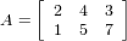

# R Introduction

## R Session
After R is started, there is a console awaiting input. At the prompt (>), you can enter numbers and perform calculations. 

```
> 1 + 2 
[1] 3 
```

## Variable Assignment
We assign values to variables with the assignment operator "=". Just typing the variable by itself at the prompt will print out the value. We should note that another form of assignment operator "<-" is also in use. 

```
> x = 1 
> x 
[1] 1 
```

## Functions
R functions are invoked by its name, then followed by the parenthesis, and zero or more arguments. The following apply the function c to combine three numeric values into a vector. 

```
> c(1, 2, 3) 
[1] 1 2 3 
```

## Comments
All text after the pound sign "#" within the same line is considered a comment. 

```
> 1 + 1      # this is a comment 
[1] 2 
```

## Extension Packages
Sometimes we need additional functionality beyond those offered by the core R library. In order to install an extension package, you should invoke the install.packages function at the prompt and follow the instruction. 

```
> install.packages() 
```

## Getting Help
R provides extensive documentation. For example, entering ?c or help(c) at the prompt gives documentation of the function c in R. Please give it a try. 
```
> help(c) 
```

If you are not sure about the name of the function you are looking for, you can perform a fuzzy search with the apropos function. 

``` 
> apropos("nova") 
[1] "anova"                "anova.glm" 
   .... 
```

Finally, there is an R specific Internet search engine at http://www.rseek.org for more assistance. 

## Numeric
Decimal values are called numerics in R. It is the default computational data type. If we assign a decimal value to a variable x as follows, x will be of numeric type. 
```
> x = 10.5       # assign a decimal value 
> x              # print the value of x 
[1] 10.5 
> class(x)       # print the class name of x 
[1] "numeric" 
```

## Logical
A logical value is often created via comparison between variables. 
```
> x = 1; y = 2   # sample values 
> z = x > y      # is x larger than y? 
> z              # print the logical value 
[1] FALSE 
> class(z)       # print the class name of z 
[1] "logical" 
```
Standard logical operations are "&" (and), "|" (or), and "!" (negation). 
```
> u = TRUE; v = FALSE 
> u & v          # u AND v 
[1] FALSE 
> u | v          # u OR v 
[1] TRUE 
> !u             # negation of u 
[1] FALSE 
```
Further details and related logical operations can be found in the R documentation. 
```
> help("&") 
```

## Character
A character object is used to represent string values in R. We convert objects into character values with the as.character() function: 
```
> x = as.character(3.14) 
> x              # print the character string 
[1] "3.14" 
> class(x)       # print the class name of x 
[1] "character" 
```

Two character values can be concatenated with the paste function. 

```
> fname = "Joe"; lname ="Smith" 
> paste(fname, lname) 
[1] "Joe Smith" 
```

To extract a substring, we apply the substr function. Here is an example showing how to extract the substring between the third and twelfth positions in a string. 

```
> substr("Mary has a little lamb.", start=3, stop=12) 
[1] "ry has a l" 
And to replace the first occurrence of the word "little" by another word "big" in the string, we apply the sub function. 
> sub("little", "big", "Mary has a little lamb.") 
[1] "Mary has a big lamb." 
```

## Vector
A vector is a sequence of data elements of the same basic type. Members in a vector are officially called components. Nevertheless, we will just call them members in this site. 
Here is a vector containing three numeric values 2, 3 and 5. 

```
> c(2, 3, 5) 
[1] 2 3 5 
And here is a vector of logical values. 
> c(TRUE, FALSE, TRUE, FALSE, FALSE) 
[1]  TRUE FALSE  TRUE FALSE FALSE 
```

A vector can contain character strings. 

```
> c("aa", "bb", "cc", "dd", "ee") 
[1] "aa" "bb" "cc" "dd" "ee" 
```

Incidentally, the number of members in a vector is given by the length function. 

```
> length(c("aa", "bb", "cc", "dd", "ee")) 
[1] 5 
```

## Combining Vectors
Vectors can be combined via the function c. For examples, the following two vectors n and s are combined into a new vector containing elements from both vectors. 
```
> n = c(2, 3, 5) 
> s = c("aa", "bb", "cc", "dd", "ee") 
> c(n, s) 
[1] "2"  "3"  "5"  "aa" "bb" "cc" "dd" "ee" 
```

### Value Coercion
In the code snippet above, notice how the numeric values are being coerced into character strings when the two vectors are combined. This is necessary so as to maintain the same primitive data type for members in the same vector. 

## Vector Arithmetics
Arithmetic operations of vectors are performed member-by-member, i.e., memberwise. 
For example, suppose we have two vectors a and b. 
```
> a = c(1, 3, 5, 7) 
> b = c(1, 2, 4, 8) 
```
Then, if we multiply a by 5, we would get a vector with each of its members multiplied by 5. 
```
> 5 * a 
[1]  5 15 25 35 
```
And if we add a and b together, the sum would be a vector whose members are the sum of the corresponding members from a and b. 
```
> a + b 
[1]  2  5  9 15 
```
Similarly for subtraction, multiplication and division, we get new vectors via memberwise operations. 
```
> a - b 
[1]  0  1  1 -1 
 
> a * b 
[1]  1  6 20 56 
 
> a / b 
[1] 1.000 1.500 1.250 0.875 
```

## Recycling Rule
If two vectors are of unequal length, the shorter one will be recycled in order to match the longer vector. For example, the following vectors u and v have different lengths, and their sum is computed by recycling values of the shorter vector u. 
```
> u = c(10, 20, 30) 
> v = c(1, 2, 3, 4, 5, 6, 7, 8, 9) 
> u + v 
[1] 11 22 33 14 25 36 17 28 39 
```

## Vector Index
We retrieve values in a vector by declaring an index inside a single square bracket "[]" operator. 
For example, the following shows how to retrieve a vector member. Since the vector index is 1-based, we use the index position 3 for retrieving the third member. 
```
> s = c("aa", "bb", "cc", "dd", "ee") 
> s[3] 
[1] "cc" 
```
Unlike other programming languages, the square bracket operator returns more than just individual members. In fact, the result of the square bracket operator is another vector, and s[3] is a vector slice containing a single member "cc". 

### Negative Index
If the index is negative, it would strip the member whose position has the same absolute value as the negative index. For example, the following creates a vector slice with the third member removed. 
```
> s[-3] 
[1] "aa" "bb" "dd" "ee" 
```

### Out-of-Range Index
If an index is out-of-range, a missing value will be reported via the symbol NA. 
```
> s[10] 
[1] NA 
```

### Numeric Index Vector
A new vector can be sliced from a given vector with a numeric index vector, which consists of member positions of the original vector to be retrieved. 
Here it shows how to retrieve a vector slice containing the second and third members of a given vector s. 
```
> s = c("aa", "bb", "cc", "dd", "ee") 
> s[c(2, 3)] 
[1] "bb" "cc" 
```

### Duplicate Indexes
The index vector allows duplicate values. Hence the following retrieves a member twice in one operation. 
```
> s[c(2, 3, 3)] 
[1] "bb" "cc" "cc" 
```
### Out-of-Order Indexes
The index vector can even be out-of-order. Here is a vector slice with the order of first and second members reversed. 
```
> s[c(2, 1, 3)] 
[1] "bb" "aa" "cc" 
```
### Range Index
To produce a vector slice between two indexes, we can use the colon operator ":". This can be convenient for situations involving large vectors. 
```
> s[2:4] 
[1] "bb" "cc" "dd" 
```
More information for the colon operator is available in the R documentation. 
```
> help(":") 
```

## Named Vector Members
We can assign names to vector members. 
For example, the following variable v is a character string vector with two members. 
```
> v = c("Mary", "Sue") 
> v 
[1] "Mary" "Sue" 
```
We now name the first member as First, and the second as Last. 
```
> names(v) = c("First", "Last") 
> v 
 First   Last 
"Mary"  "Sue" 
```
Then we can retrieve the first member by its name. 
```
> v["First"] 
[1] "Mary" 
```
Furthermore, we can reverse the order with a character string index vector. 
```
> v[c("Last", "First")] 
  Last  First 
 "Sue" "Mary" 
```

## Matrix
A matrix is a collection of data elements arranged in a two-dimensional rectangular layout. The following is an example of a matrix with 2 rows and 3 columns. 


 
We reproduce a memory representation of the matrix in R with the matrix function. The data elements must be of the same basic type. 
```
> A = matrix( 
+   c(2, 4, 3, 1, 5, 7), # the data elements 
+   nrow=2,              # number of rows 
+   ncol=3,              # number of columns 
+   byrow = TRUE)        # fill matrix by rows 
 
> A                      # print the matrix 
     [,1] [,2] [,3] 
[1,]    2    4    3 
[2,]    1    5    7 
```
An element at the mth row, nth column of A can be accessed by the expression A[m, n]. 
```
> A[2, 3]      # element at 2nd row, 3rd column 
[1] 7 
```
The entire mth row A can be extracted as A[m, ]. 
```
> A[2, ]       # the 2nd row 
[1] 1 5 7 
```
Similarly, the entire nth column A can be extracted as A[ ,n]. 
```
> A[ ,3]       # the 3rd column 
[1] 3 7 
```
We can also extract more than one rows or columns at a time. 
```
> A[ ,c(1,3)]  # the 1st and 3rd columns 
     [,1] [,2] 
[1,]    2    3 
[2,]    1    7 
```
If we assign names to the rows and columns of the matrix, than we can access the elements by names. 
```
> dimnames(A) = list( 
+   c("row1", "row2"),         # row names 
+   c("col1", "col2", "col3")) # column names 
 
> A                 # print A 
     col1 col2 col3 
row1    2    4    3 
row2    1    5    7 
 
> A["row2", "col3"] # element at 2nd row, 3rd column 
[1] 7 
```

## Matrix Construction
There are various ways to construct a matrix. When we construct a matrix directly with data elements, the matrix content is filled along the column orientation by default. For example, in the following code snippet, the content of B is filled along the columns consecutively. 
```
> B = matrix( 
+   c(2, 4, 3, 1, 5, 7), 
+   nrow=3, 
+   ncol=2) 
 
> B             # B has 3 rows and 2 columns 
     [,1] [,2] 
[1,]    2    1 
[2,]    4    5 
[3,]    3    7 
```

## Transpose
We construct the transpose of a matrix by interchanging its columns and rows with the function t . 
```
> t(B)          # transpose of B 
     [,1] [,2] [,3] 
[1,]    2    4    3 
[2,]    1    5    7 
```

## Combining Matrices
The columns of two matrices having the same number of rows can be combined into a larger matrix. For example, suppose we have another matrix C also with 3 rows. 
```
> C = matrix( 
+   c(7, 4, 2), 
+   nrow=3, 
+   ncol=1) 
 
> C             # C has 3 rows 
     [,1] 
[1,]    7 
[2,]    4 
[3,]    2 
```
Then we can combine the columns of B and C with cbind. 
```
> cbind(B, C) 
     [,1] [,2] [,3] 
[1,]    2    1    7 
[2,]    4    5    4 
[3,]    3    7    2 
```
Similarly, we can combine the rows of two matrices if they have the same number of columns with the rbind function. 
```
> D = matrix( 
+   c(6, 2), 
+   nrow=1, 
+   ncol=2) 
 
> D             # D has 2 columns 
     [,1] [,2] 
[1,]    6    2 

> rbind(B, D) 
     [,1] [,2] 
[1,]    2    1 
[2,]    4    5 
[3,]    3    7 
[4,]    6    2 
```

## Deconstruction
We can deconstruct a matrix by applying the c function, which combines all column vectors into one. 
```
> c(B) 
[1] 2 4 3 1 5 7 
```

## Data Frame Row Slice
We retrieve rows from a data frame with the single square bracket operator, just like what we did with columns. However, in additional to an index vector of row positions, we append an extra comma character. This is important, as the extra comma signals a wildcard match for the second coordinate for column positions. 

## Numeric Indexing
For example, the following retrieves a row record of the built-in data set mtcars. Please notice the extra comma in the square bracket operator, and it is not a typo. It states that the 1974 Camaro Z28 has a gas mileage of 13.3 miles per gallon, and an eight cylinder 245 horse power engine, ..., etc. 
```
> mtcars[24,] 
            mpg cyl disp  hp drat   wt  ... 
Camaro Z28 13.3   8  350 245 3.73 3.84  ... 
To retrieve more than one rows, we use a numeric index vector. 
> mtcars[c(3, 24),] 
            mpg cyl disp  hp drat   wt  ... 
Datsun 710 22.8   4  108  93 3.85 2.32  ... 
Camaro Z28 13.3   8  350 245 3.73 3.84  ... 
```

## Name Indexing
We can retrieve a row by its name. 
```
> mtcars["Camaro Z28",] 
            mpg cyl disp  hp drat   wt  ... 
Camaro Z28 13.3   8  350 245 3.73 3.84  ... 
```
And we can pack the row names in an index vector in order to retrieve multiple rows.
``` 
> mtcars[c("Datsun 710", "Camaro Z28"),] 
            mpg cyl disp  hp drat   wt  ... 
Datsun 710 22.8   4  108  93 3.85 2.32  ... 
Camaro Z28 13.3   8  350 245 3.73 3.84  ... 
```

## Logical Indexing
Lastly, we can retrieve rows with a logical index vector. In the following vector L, the member value is TRUE if the car has automatic transmission, and FALSE if otherwise. 
```
> L = mtcars$am == 0 
> L 
 [1]   FALSE FALSE FALSE  TRUE ... 
```
Here is the list of vehicles with automatic transmission. 
```
> mtcars[L,] 
                     mpg cyl  disp  hp drat    wt  ... 
Hornet 4 Drive      21.4   6 258.0 110 3.08 3.215  ... 
Hornet Sportabout   18.7   8 360.0 175 3.15 3.440  ... 
                 ............ 
```
And here is the gas mileage data for automatic transmission. 
```
> mtcars[L,]$mpg 
 [1] 21.4 18.7 18.1 14.3 24.4 ... 
```

## Data Frame Column Slice
We retrieve a data frame column slice with the single square bracket "[]" operator. 

### Numeric Indexing
The following is a slice containing the first column of the built-in data set mtcars. 
```
> mtcars[1] 
                   mpg 
Mazda RX4         21.0 
Mazda RX4 Wag     21.0 
Datsun 710        22.8 
                   ............ 
```
### Name Indexing
We can retrieve the same column slice by its name. 
```
> mtcars["mpg"] 
                   mpg 
Mazda RX4         21.0 
Mazda RX4 Wag     21.0 
Datsun 710        22.8 
                   ............ 
```
To retrieve a data frame slice with the two columns mpg and hp, we pack the column names in an index vector inside the single square bracket operator. 
```
> mtcars[c("mpg", "hp")] 
                   mpg  hp 
Mazda RX4         21.0 110 
Mazda RX4 Wag     21.0 110 
Datsun 710        22.8  93 
                   ............ 
```

## Qualitative Data
A data sample is called qualitative, also known as categorical, if its values belong to a collection of known defined non-overlapping classes. Common examples include student letter grade (A, B, C, D or F), commercial bond rating (AAA, AAB, ...) and consumer clothing shoe sizes (1, 2, 3, ...). 
The tutorials in this section are based on an R built-in data frame named painters. It is a compilation of technical information of a few eighteenth century classical painters. The data set belongs to the MASS package, and has to be pre-loaded into the R workspace prior to its use. 
```
> library(MASS)      # load the MASS package 
> painters 
              Composition Drawing Colour Expression School 
Da Udine               10       8     16          3      A 
Da Vinci               15      16      4         14      A 
Del Piombo              8      13     16          7      A 
Del Sarto              12      16      9          8      A 
Fr. Penni               0      15      8          0      A 
Guilio Romano          15      16      4         14      A 
                    ................. 
```
The last School column contains the information of school classification of the painters. The schools are named as A, B, ..., etc, and the School variable is qualitative. 
```
> painters$School 
 [1] A A A A A A A A A A B B B B B B C C C C C C D D D D 
[27] D D D D D D E E E E E E E F F F F G G G G G G G H H 
[53] H H 
Levels: A B C D E F G H 
```

## Frequency Distribution of Qualitative Data
The frequency distribution of a data variable is a summary of the data occurrence in a collection of non-overlapping categories. 

### Example
In the data set painters, the frequency distribution of the School variable is a summary of the number of painters in each school. 

#### Problem
Find the frequency distribution of the painter schools in the data set painters. 

#### Solution
We apply the table function to compute the frequency distribution of the School variable. 
```
> library(MASS)                 # load the MASS package 
> school = painters$School      # the painter schools 
> school.freq = table(school)   # apply the table function 
```

#### Answer
The frequency distribution of the schools is: 
```
> school.freq 
school 
 A  B  C  D  E  F  G  H 
10  6  6 10  7  4  7  4 
```

#### Enhanced Solution
We apply the cbind function to print the result in column format. 
```
> cbind(school.freq) 
  school.freq 
A          10 
B           6 
C           6 
D          10 
E           7 
F           4 
G           7 
H           4 
```

### Exercise
1. Find the frequency distribution of the composition scores in painters. 
2. Find programmatically the school that has the most painters.

## Relative Frequency Distribution of Qualitative Data
The relative frequency distribution of a data variable is a summary of the frequency proportion in a collection of non-overlapping categories. 
The relationship of frequency and relative frequency is: 
 
### Example
In the data set painters, the relative frequency distribution of the School variable is a summary of the proportion of painters in each school. 

#### Problem
Find the relative frequency distribution of the painter schools in the data set painters. 

#### Solution
We first apply the table function to compute the frequency distribution of the School variable. 
```
> library(MASS)                 # load the MASS package 
> school = painters$School      # the painter schools 
> school.freq = table(school)   # apply the table function 
```
Then we find the sample size of painters with the nrow function, and divide the frequency distribution with it. Therefore the relative frequency distribution is: 
```
> school.relfreq = school.freq / nrow(painters) 
```

#### Answer
The relative frequency distribution of the schools is: 
```
> school.relfreq 
school 
       A        B        C        D        E        F 
0.185185 0.111111 0.111111 0.185185 0.129630 0.074074 
       G        H 
0.129630 0.074074 
```

#### Enhanced Solution
We can print with fewer digits and make it more readable by setting the digits option. 
```
> old = options(digits=1) 
> school.relfreq 
school 
   A    B    C    D    E    F    G    H 
0.19 0.11 0.11 0.19 0.13 0.07 0.13 0.07 
> options(old) 
```

In addition, we can apply the cbind function to print the result in column format. 
```
> old = options(digits=1) 
> cbind(school.relfreq) 
  school.relfreq 
A           0.19 
B           0.11 
C           0.11 
D           0.19 
E           0.13 
F           0.07 
G           0.13 
H           0.07 
> options(old)    # restore the old option 
```

### Exercise
Find the relative frequency distribution of the composition scores in painters. 

## Mean
The mean of an observation variable is a numerical measure of the central location of the data values. It is the sum of its data values divided by data count. 
Hence, for a data sample of size n, its sample mean is defined as follows: 
 
Similarly, for a data population of size N, the population mean is: 
 
### Problem
Find the mean eruption duration in the data set faithful. 

### Solution
We apply the mean function to compute the mean value of eruptions. 
```
> duration = faithful$eruptions     # the eruption durations 
> mean(duration)                    # apply the mean function 
[1] 3.4878 
```

### Answer
The mean eruption duration is 3.4878 minutes. 

### Exercise
Find the mean eruption waiting periods in faithful. 

## Median
The median of an observation variable is the value at the middle when the data is sorted in ascending order. It is an ordinal measure of the central location of the data values. 

### Problem
Find the median of the eruption duration in the data set faithful. 

### Solution
We apply the median function to compute the median value of eruptions. 
```
> duration = faithful$eruptions     # the eruption durations 
> median(duration)                  # apply the median function 
[1] 4 
```

### Answer
The median of the eruption duration is 4 minutes. 

### Exercise
Find the median of the eruption waiting periods in faithful. 

## Quartile
There are several quartiles of an observation variable. The first quartile, or lower quartile, is the value that cuts off the first 25% of the data when it is sorted in ascending order. The second quartile, or median, is the value that cuts off the first 50%. The third quartile, or upper quartile, is the value that cuts off the first 75%. 

### Problem
Find the quartiles of the eruption durations in the data set faithful. 

### Solution
We apply the quantile function to compute the quartiles of eruptions. 
```
> duration = faithful$eruptions     # the eruption durations 
> quantile(duration)                # apply the quantile function 
    0%    25%    50%    75%   100% 
1.6000 2.1627 4.0000 4.4543 5.1000 
```

### Answer
The first, second and third quartiles of the eruption duration are 2.1627, 4.0000 and 4.4543 minutes respectively. 

### Exercise
Find the quartiles of the eruption waiting periods in faithful. 

__Note__
There are several algorithms for the computation of quartiles. Details can be found in the R documentation via help(quantile). 

